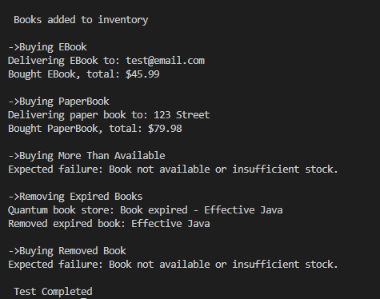

#  Java Book Store System

A simple Java-based console application that simulates an e-commerce checkout system

---

##  Features

**Inventory management**
- Add books with isbn, title, author, year, price, quantity
- Remove outdated books based on a provided number of years from publishment

**Design Pattern in the Code**
- Inheritence from the Book Object 
- Polymorphism at every class

**Extensubilty**
- Easly extensible to add new features without modifying existing system logic 
---

##  Screen Shot Output

